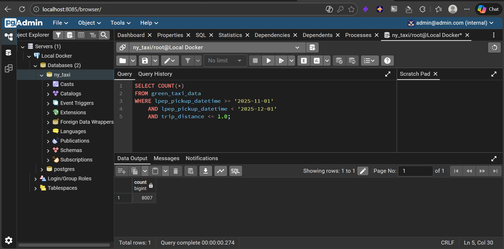
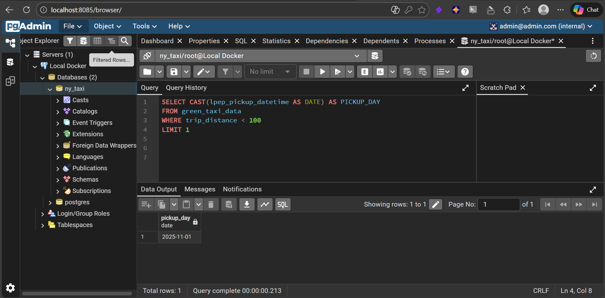
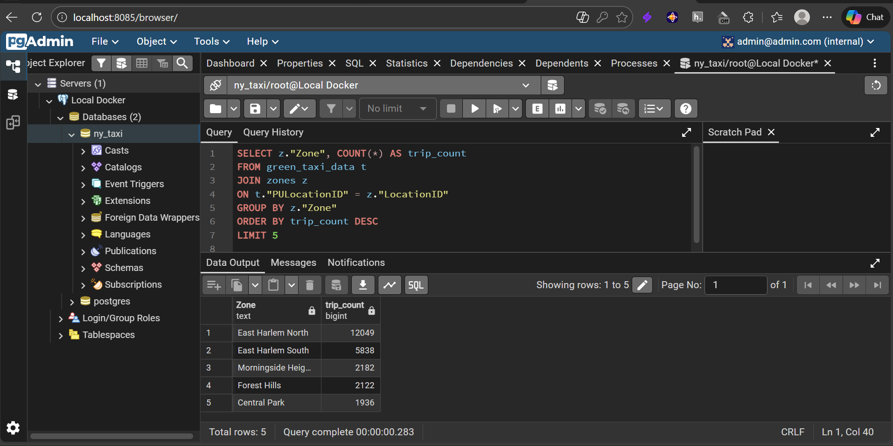
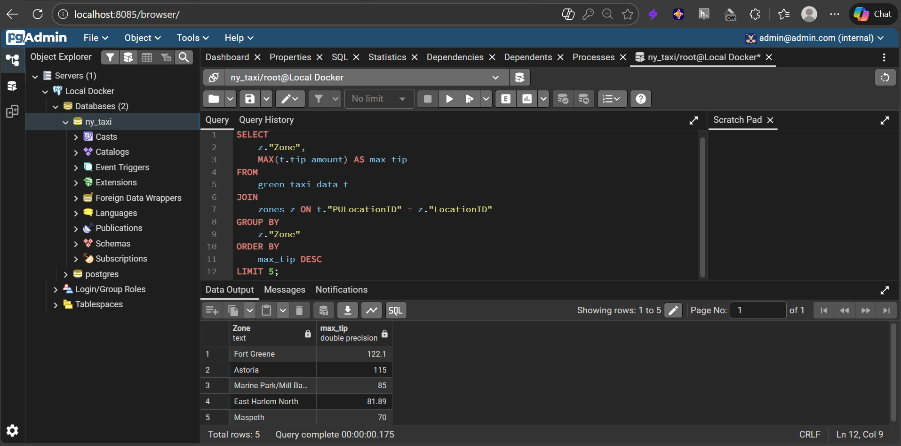

# Docker and SQL: Data Engineering Zoomcamp Module 1 Homework

* Course: [Data Engineering Zoomcamp](https://github.com/DataTalksClub/data-engineering-zoomcamp)
* Dataset: [NYC Green Taxi November 2025](https://d37ci6vzurychx.cloudfront.net/trip-data/green_tripdata_2025-11.parquet)
* Code: [ingest_data.py](ingest_data.py)

This repository contains the homework solutions for Module 1. The project involves containerizing a data ingestion pipeline with Docker, managing a PostgreSQL database with Docker Compose, and performing SQL analysis.

---

## 🛠️ Homework Solutions

### 1. Understanding Docker & Networking
* **Question 1 (pip version):** `24.3.1`
* **Question 2 (Hostname/Port):** `db:5432`
* **Question 7 (Terraform Workflow):** `terraform init, terraform apply -auto-approve, terraform destroy`

### 2. SQL Analytics (November 2025 Data)

#### Question 3: Counting Short Trips
Trips with a distance ≤ 1 mile: **8007**.


#### Question 4: Longest Trip per Day
The day with the longest trip distance (< 100 miles) was: **2025-11-23**.


#### Question 5: Biggest Pickup Zone
Pickup zone with the largest total_amount on November 18th, 2025: **East Harlem South**.


#### Question 6: Largest Tip
For passengers picked up in "East Harlem North", the drop-off zone with the largest tip was: **JFK Airport**.


---

## 📁 Prerequisites & Setup

- **Python 3.13** (Managed via `uv`)
- **Docker & Docker Compose**
- **Google Cloud SDK** (For Terraform/GCP tasks)

### Running the Pipeline
1. **Start Services:**
   ```bash
   docker-compose up -d
   ```
2. **Ingest Green Taxi Data:**
    ```bash
    uv run python ingest_data.py --user=root --password=root --host=localhost --port=5432 --db=ny_taxi --table=green_taxi_data --url="[https://d37ci6vzurychx.cloudfront.net/trip-data/green_tripdata_2025-11.parquet](https://d37ci6vzurychx.cloudfront.net/trip-data/green_tripdata_2025-11.parquet)"
    ```
3. Ingest Zone Lookup:
    ```bash
    uv run python ingest_data.py --user=root --password=root --host=localhost --port=5432 --db=ny_taxi --table=zones --url="[https://github.com/DataTalksClub/nyc-tlc-data/releases/download/misc/taxi_zone_lookup.csv](https://github.com/DataTalksClub/nyc-tlc-data/releases/download/misc/taxi_zone_lookup.csv)"
    ```